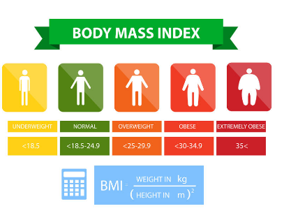
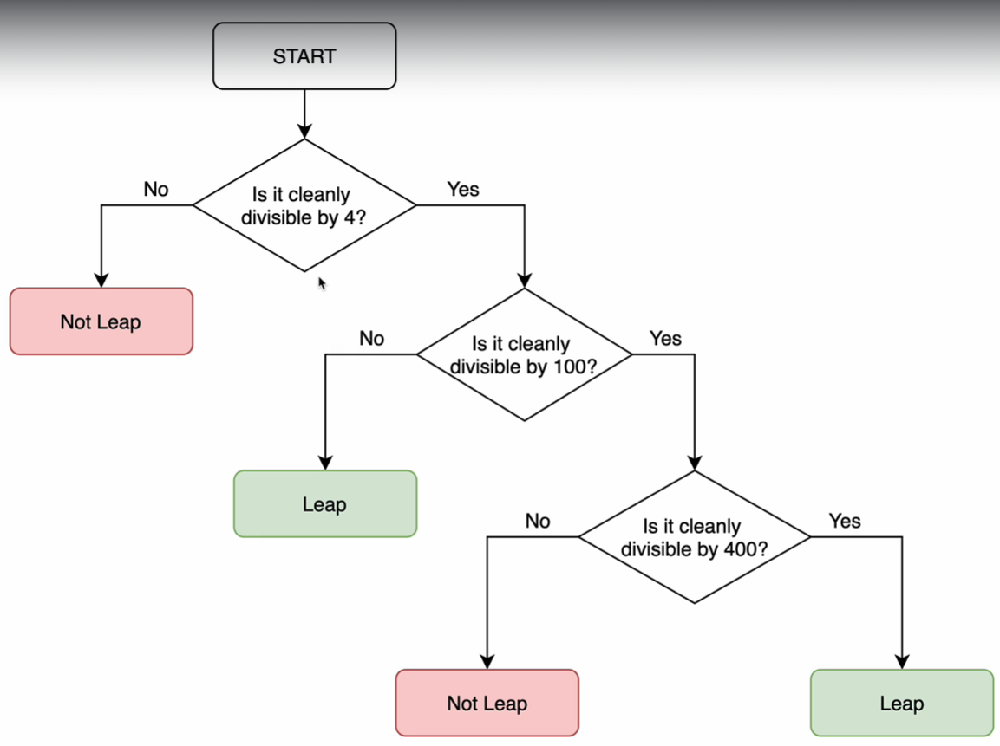
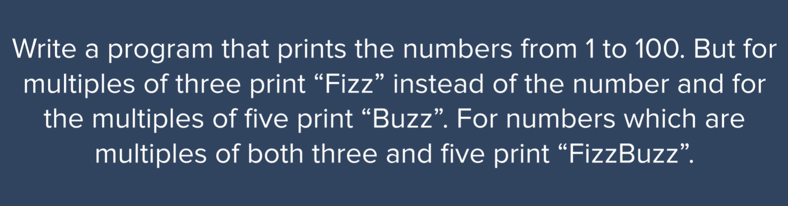
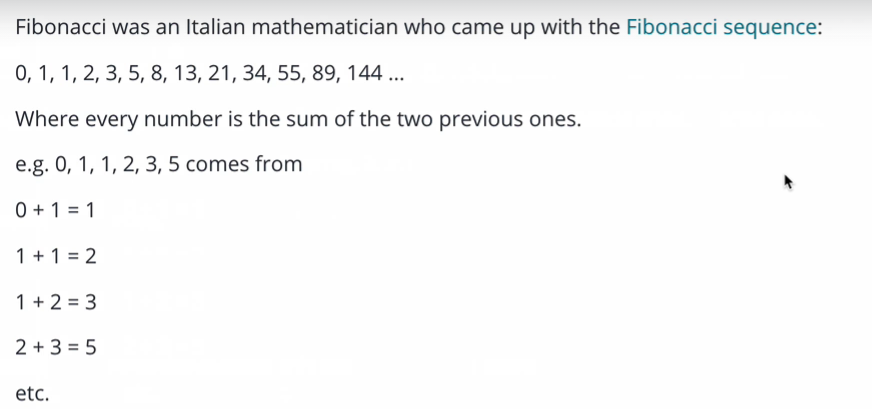

# extra-exercises-JS-Part2

# JavaScript Code Challenges

This repository contains a collection of JavaScript code challenges that demonstrate various programming concepts and problem-solving techniques. Each challenge is designed to improve your JavaScript skills and understanding.

## Table of Contents

1. Calculate Life in Weeks
2. BMI Calculator
3. Love Calculator
4. Leap Year Checker
5. Name Checker in Array
6. FizzBuzz
7. Lunch Buyer
8. Print Numbers Except 50
9. Print Specific Numbers
10. Fibonacci Generator

## Table of Figures

# 
# 
# 
# 
# 

